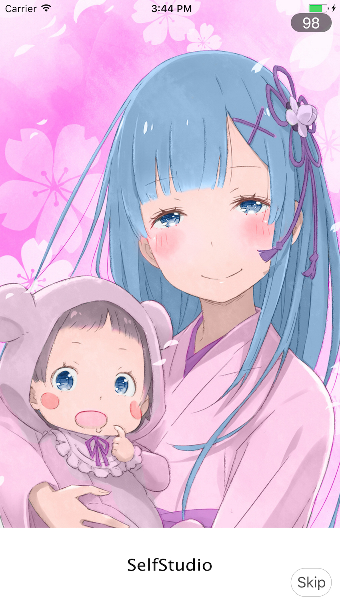

#<font color='#B2D3FE'>R</font><font color='#8465B3'>e</font><font color='#655367'>m</font>
---
A maid helps you handle with launching Ads
#Feature
---
- [x] Optional shows(1s) blank page when image not downloaded

- [x] Support tapping the content, showing countdown info or skip button

- [x] Support customize trademark

---
#Screenshot

---
#Usage
```swift
  import Rem
// func application(_ application: UIApplication, didFinishLaunchingWithOptions launchOptions: [UIApplicationLaunchOptionsKey: Any]?) -> Bool {
    let ad = Rem.Work(...)// watch demo for detail
    Rem.shared.show(advertisement: ad)
// return true
//}
```
#Wiki
states For handling user event
```swift
  //Rem.Work.State
  public enum State { case complete, idle, blank, tap, skip }
```
